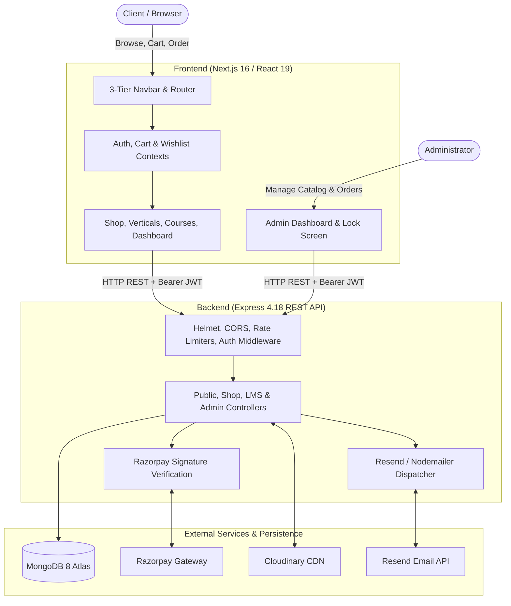
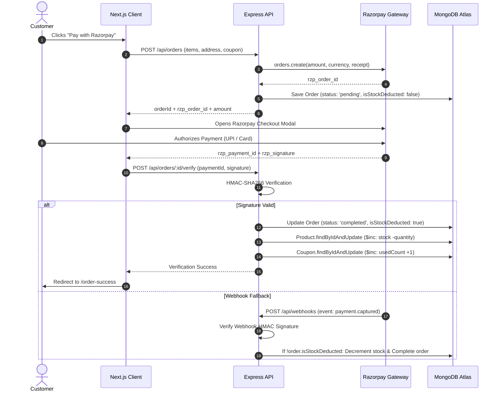
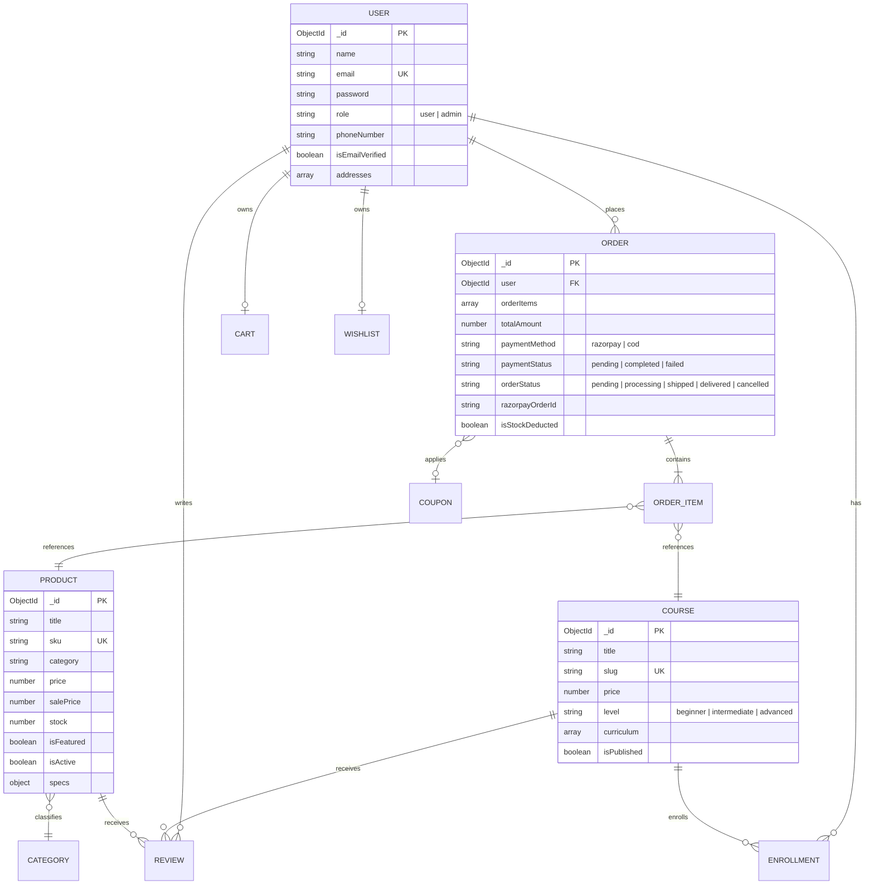

# PROJECT ARCHITECTURE & CODEBASE AUDIT: North Tech Hub

> **Official AI-Maintainable Primary Project Documentation & Source of Truth**  
> **Repository:** `Flash` / `sunil-sir-project` (Production: `https://www.northtechhub.in`)  
> **Audit Date:** 2026-09-18 | **Documentation Version:** 1.0.0  
> **Source of Truth:** Verified Repository Source Code, Data Schemas, API Contracts & Tests

---

## 1. Executive Summary & Project Overview

**North Tech Hub** is a commercial full-stack web platform operating a dual-business model:
1. **Commercial Hardware E-Commerce:** Specializing in genuine new electronics, certified refurbished laptops (ThinkPad, Dell Latitude, HP EliteBook, Apple MacBook), computer accessories, IoT boards (ESP32, Raspberry Pi), robotics kits, and components across India.
2. **EdTech Course Marketplace (LMS):** Providing structured programming and tech skills courses with modular curricula, video delivery, student progress checklists, and certification.

### Core Objectives
- High-conversion shopping funnel with client-side persistence, coupon calculation engine, dynamic promotional banners, and instant cart/wishlist sync.
- Razorpay payment integration supporting UPI, credit/debit cards, Net Banking, and Cash on Delivery (COD) with atomic inventory reconciliation.
- Dedicated vertical shopping experiences for Refurbished Laptops, IoT/Robotics, Computer Accessories, and Online Courses.
- Inactivity-hardened administrative suite for catalog management, stock replenishment, promotional campaigns, order dispatching, and sales analytics PDF generation.

---

## 2. Current Project Status

```text
PROJECT STATUS SNAPSHOT
-----------------------
Current Version:       1.0.0
Last Audited:          2026-09-18
Primary Platform:      Web (Desktop, Tablet, Mobile responsive)
Architecture:          Full-Stack Monorepo (npm workspaces: frontend, backend, codex-seo)
Development Status:    Active Development / Final Hardening (~90% Complete)
Production Status:     Pre-Release / Staging (Local verified, Vercel backend adapter present)
Major Features:        E-Commerce Catalog, 4 Dedicated Verticals, Cart/Wishlist Sync, 
                       Razorpay Checkout, Course LMS, Admin Panel, Analytics PDF Exports
Known Blockers:        Live sandbox verification of Razorpay webhooks on public domain
Critical Issues:       None blocking execution
Technical Debt:        Duplicate OAuth callback routes; duplicate EmailVerification.ts model; 
                       duplicate Mongoose schema index declarations on Coupon and Category
```

---

## 3. Repository Structure Audit

```
sunil-sir-project/
├── frontend/                          # Next.js 16 App Router application
│   ├── app/                           # Route groups: (auth), (courses), (dashboard), (shop), checkout
│   │   ├── (auth)/                    # Authentication pages (login, register, verify, callback)
│   │   ├── (courses)/                 # Course catalog, detail overview, interactive lesson viewer
│   │   ├── (dashboard)/               # User profile, order tracker, enrolled courses, admin dashboard
│   │   ├── (shop)/                    # E-commerce store (products, laptops, iot, accessories, cart, checkout)
│   │   ├── checkout/course/           # Dedicated checkout workflow for digital courses
│   │   ├── layout.tsx                 # Root layout injecting Context Providers & Navigation
│   │   ├── page.tsx                   # Commercial homepage with dynamic storefront sections
│   │   └── sitemap.ts                 # Dynamic XML sitemap generator with vertical routes
│   ├── components/                    # Component hierarchy
│   │   ├── admin/                     # Admin tab modules (Products, Orders, Courses, Promotions, Users)
│   │   ├── auth/                      # Login & registration forms, OTP modals, Google buttons
│   │   ├── cart/                      # Cart drawers, item cards, coupon inputs, price summaries
│   │   ├── checkout/                  # Multi-step checkout, address selectors, payment modals
│   │   ├── courses/                   # Course cards, curriculum accordions, lesson player
│   │   ├── home/                      # Commercial storefront sections (Hero, Verticals, FlashSale, etc.)
│   │   ├── layout/                    # 3-tier Robocraze-inspired Navbar, Footer, Mobile Drawer
│   │   ├── products/                  # Product cards, badge chips, specs tables, reviews breakdown
│   │   └── ui/                        # Reusable buttons, badges, modals, toast alerts
│   ├── lib/                           # Core utilities & API layer
│   │   ├── api/                       # Typed HTTP API client modules for each domain
│   │   ├── context/                   # React Context state managers (Auth, Cart, Wishlist, Toast)
│   │   ├── hooks/                     # Custom hooks (accessibility, offers, countdowns, debounce)
│   │   └── utils.ts                   # CSS class merging, currency formatters, date helpers
│   ├── public/                        # Static public assets (logos, placeholders, favicons)
│   └── src/styles/                    # Tailwind CSS v4 & custom styles (globals.css)
├── backend/                           # Express.js REST API application
│   ├── api/                           # Serverless deployment adapter for Vercel
│   ├── src/
│   │   ├── config/                    # db.js (MongoDB Mongoose), passport.js, cloudinary.js
│   │   ├── controllers/               # Express request controllers
│   │   │   └── admin/                 # Dedicated admin controllers (analytics, orders, promotions)
│   │   ├── middlewares/               # authMiddleware.js, errorHandler.js, rateLimiter.js
│   │   ├── models/                    # Mongoose data models
│   │   ├── routes/                    # API route definitions
│   │   ├── scripts/                   # DB seeders (seedAccessories.js, seedNorthTechHub.js, createAdmin.js)
│   │   ├── utils/                     # payment.js (Razorpay), email.js (Resend/SMTP), validateEnv.js
│   │   ├── app.js                     # Express application factory, middleware chain, CORS, routes
│   │   └── server.js                  # HTTP server bootstrapper, MongoDB connection, graceful shutdown
│   └── __tests__/                     # Jest backend test suites (auth, cart, orders, payment, products)
├── codex-seo/                         # Autonomous SEO auditing and metadata toolchain
├── docs/
│   └── DEVELOPMENT_AUDIT.md           # Official chronological development audit ledger
└── package.json                       # Monorepo root workspace configuration
```

---

## 4. Technology Stack Audit

| Category | Technology | Version | Purpose | Status |
| :--- | :--- | :--- | :--- | :--- |
| **Monorepo Engine** | npm workspaces | `>=8.0.0` | Dependency orchestration across frontend & backend | Active |
| **Frontend Framework** | Next.js (App Router) | `16.1.0` | Server/Client rendering, routing, Turbopack dev server | Active |
| **UI Library** | React | `19.2.3` | Core UI component tree | Active |
| **Language (Frontend)** | TypeScript | `5.x` | Static typing and interfaces | Active |
| **Styling** | Tailwind CSS | `4.x` | Utility-first styling with `@tailwindcss/postcss` | Active |
| **Animations / Icons** | Framer Motion & Lucide | `12.27.1` / `0.563.0` | Micro-interactions, transitions, vector icons | Active |
| **Data Viz & Barcodes** | Recharts, react-barcode | `3.6.0` / `1.6.1` | Admin analytics charts and order receipt barcodes | Active |
| **Backend Framework** | Node.js + Express.js | `4.18.2` | RESTful API server (CommonJS) | Active |
| **Database & ODM** | MongoDB + Mongoose | `8.0.3` | Document database and object data modeling | Active |
| **Authentication** | JWT & Passport.js | `9.0.2` / `0.7.0` | Stateless token auth + Google OAuth 2.0 | Active |
| **Payments** | Razorpay Node SDK | `2.9.6` | Order creation, payment capture, webhook HMAC | Active |
| **Email Delivery** | Resend & Nodemailer | `6.9.4` / `6.9.8` | Transactional email delivery and OTP dispatch | Active |
| **Media Storage** | Cloudinary + Multer | `1.41.3` / `2.0.2` | Cloud asset upload with local `/uploads` fallback | Active |
| **PDF Generation** | PDFKit | `0.17.2` | Printable invoice and analytics PDF document export | Active |
| **Security Middleware** | Helmet, mongo-sanitize | `7.1.0` / `2.2.0` | HTTP headers, NoSQL injection prevention, XSS clean | Active |
| **Testing Engine** | Jest & Supertest | `30.2.0` / `7.2.2` | Backend unit, integration, and performance tests | Active |

---

## 5. Architecture Audit & System Data Flow

### Architecture Pattern
The project implements a decoupled **Client-Server Architecture** within an npm monorepo:
- **Frontend Layer:** Next.js 16 App Router using React Server Components for metadata and Client Components for dynamic user state.
- **API Gateway / Backend Layer:** Express.js REST API with modular routers, controller handlers, and service middleware.
- **Persistence Layer:** MongoDB Atlas with Mongoose ODM enforcing schemas, compound indexes, and validation.



### E-Commerce Stock & Payment Settlement Flow



---

## 6. Feature & Module Audit

| Feature Name | Primary Purpose | Entry Point | Relevant Screens / Components | API Dependencies | Status |
| :--- | :--- | :--- | :--- | :--- | :--- |
| **Authentication** | User register, login, OTP verification, Google OAuth | `/login`, `/register` | `LoginForm`, `RegisterForm`, `VerifyEmail` | `POST /api/auth/*` | `IMPLEMENTED` |
| **Product Catalog** | Full store browsing with multi-facet filters & sorting | `/products` | `ProductCard`, `ProductFilters`, `Pagination` | `GET /api/products` | `IMPLEMENTED` |
| **Refurbished Laptops** | Dedicated vertical for certified laptops & warranty specs | `/refurbished-laptops` | `LaptopsClient`, brand filter chips, trust strip | `GET /api/products?category=laptops` | `IMPLEMENTED` |
| **IoT & Development Boards** | Hardware prototyping boards, robotics kits & sensors | `/iot` | `IoTClient`, category filter chips, trust strip | `GET /api/products?category=iot,raspberry-pi...` | `IMPLEMENTED` |
| **Computer Accessories** | Workstation peripherals, hubs, cables & chargers | `/computer-accessories` | `AccessoriesClient`, accessory filter chips | `GET /api/products?category=accessories...` | `IMPLEMENTED` |
| **Course Marketplace** | EdTech course catalog, curricula & skill levels | `/courses` | `CourseCard`, `CourseFilter`, `CourseShowcase` | `GET /api/courses` | `IMPLEMENTED` |
| **Interactive LMS Player** | Video lessons, resource downloads, progress tracking | `/courses/[id]/lessons` | `LessonPlayer`, `CurriculumAccordion`, `Progress` | `GET /api/courses/:id/lessons` | `IMPLEMENTED` |
| **Cart Management** | Client-side cart with automatic MongoDB cloud sync | `/cart` | `CartItem`, `CouponForm`, `CartSummary` | `/api/cart`, `/api/cart/sync` | `IMPLEMENTED` |
| **Wishlist** | Save favorites with instant "Move to Cart" action | `/wishlist` | `WishlistItem`, `WishlistContext` | `/api/wishlist`, `/api/wishlist/sync` | `IMPLEMENTED` |
| **Checkout & Payments** | Multi-step checkout with Razorpay and COD options | `/checkout` | `AddressSelector`, `PaymentOptions`, `OrderReview` | `POST /api/orders`, `/verify` | `IMPLEMENTED` |
| **Order Tracking** | Visual milestone delivery tracker & invoice receipt | `/orders/[id]` | `OrderTracker`, `ReceiptModal`, barcode generator | `GET /api/orders/:id` | `IMPLEMENTED` |
| **Admin Operations** | Products, orders, categories, promotions & analytics | `/admin` | `AdminDashboard`, `InactivityModal`, analytics | `GET/PUT/POST /api/admin/*` | `IMPLEMENTED` |
| **Analytics PDF Export** | Generate printable invoice receipts & sales reports | `/admin/analytics` | `analyticsController.js`, PDFKit engine | `GET /api/admin/analytics/export/*` | `IMPLEMENTED` |
| **Promotions Engine** | Flash sales, discount coupons, and hero banner carousels | Storefront | `FlashSale`, `PromoBanners`, `AnnouncementBar` | `GET /api/coupons`, `/banners` | `IMPLEMENTED` |

---

## 7. Route & Screen Audit

### Public Storefront Routes

| Route | File Path | Access Level | Purpose | Status |
| :--- | :--- | :--- | :--- | :--- |
| `/` | `frontend/app/page.tsx` | Public | Commercial homepage with live merchandising sections | `ACTIVE` |
| `/products` | `frontend/app/(shop)/products/page.tsx` | Public | Full product catalog with search, facets, and sorting | `ACTIVE` |
| `/products/[id]` | `frontend/app/(shop)/products/[id]/page.tsx` | Public | Product detail with gallery zoom, specs, reviews | `ACTIVE` |
| `/refurbished-laptops` | `frontend/app/(shop)/refurbished-laptops/page.tsx` | Public | Dedicated Refurbished Laptops vertical catalog | `ACTIVE` |
| `/laptops` | `frontend/app/(shop)/laptops/page.tsx` | Public | Alias redirect to `/refurbished-laptops` | `ACTIVE` |
| `/iot` | `frontend/app/(shop)/iot/page.tsx` | Public | Dedicated IoT, Robotics & Boards vertical catalog | `ACTIVE` |
| `/computer-accessories` | `frontend/app/(shop)/computer-accessories/page.tsx` | Public | Dedicated Computer Accessories vertical catalog | `ACTIVE` |
| `/accessories` | `frontend/app/(shop)/accessories/page.tsx` | Public | Alias redirect to `/computer-accessories` | `ACTIVE` |
| `/courses` | `frontend/app/(courses)/courses/page.tsx` | Public | EdTech course marketplace catalog | `ACTIVE` |
| `/courses/[id]` | `frontend/app/(courses)/courses/[id]/page.tsx` | Public | Course syllabus overview and learning outcomes | `ACTIVE` |
| `/courses/[id]/lessons`| `frontend/app/(courses)/courses/[id]/lessons/page.tsx`| Protected | Enrolled student video player and lesson checklist | `ACTIVE` |
| `/cart` | `frontend/app/(shop)/cart/page.tsx` | Public | Shopping cart with coupon calculation | `ACTIVE` |
| `/checkout` | `frontend/app/(shop)/checkout/page.tsx` | Protected | Multi-step physical products checkout | `ACTIVE` |
| `/checkout/course` | `frontend/app/checkout/course/page.tsx` | Protected | Specialized single-course digital checkout | `ACTIVE` |
| `/order-success` | `frontend/app/(shop)/order-success/page.tsx` | Public/Auth | Order confirmation receipt with confettis | `ACTIVE` |
| `/wishlist` | `frontend/app/(shop)/wishlist/page.tsx` | Public/Auth | User favorites list with direct add-to-cart | `ACTIVE` |
| `/faq`, `/about`, `/contact` | `frontend/app/(shop)/*` | Public | Information and customer service pages | `ACTIVE` |
| `/shipping`, `/terms`, `/privacy`, `/cookies` | `frontend/app/*` | Public | Legal and shipping documentation pages | `ACTIVE` |

### Authentication & Account Routes

| Route | File Path | Access Level | Purpose | Status |
| :--- | :--- | :--- | :--- | :--- |
| `/login` | `frontend/app/(auth)/login/page.tsx` | Public | User credential login + Google OAuth trigger | `ACTIVE` |
| `/register` | `frontend/app/(auth)/register/page.tsx` | Public | User registration with password strength check | `ACTIVE` |
| `/verify-email` | `frontend/app/(auth)/verify-email/page.tsx` | Public | 6-digit email OTP verification screen | `ACTIVE` |
| `/forgot-password` | `frontend/app/(auth)/forgot-password/page.tsx`| Public | Request password reset OTP | `ACTIVE` |
| `/reset-password` | `frontend/app/(auth)/reset-password/page.tsx` | Public | Submit new password with OTP token | `ACTIVE` |
| `/callback` | `frontend/app/(auth)/callback/page.tsx` | Public | Primary Google OAuth token reception & storage | `ACTIVE` |
| `/auth/callback` | `frontend/app/(auth)/auth/callback/page.tsx` | Public | Duplicate alias route for Google OAuth callback | `DUPLICATE` |
| `/profile` | `frontend/app/(dashboard)/profile/page.tsx` | Protected | User account details, address book, password change| `ACTIVE` |
| `/account` | `frontend/app/(dashboard)/account/page.tsx` | Protected | Consolidated account management dashboard | `ACTIVE` |
| `/orders` | `frontend/app/(dashboard)/orders/page.tsx` | Protected | User order history list | `ACTIVE` |
| `/orders/[id]` | `frontend/app/(dashboard)/orders/[id]/page.tsx` | Protected | Order tracking milestone view and receipt printout | `ACTIVE` |
| `/my-courses` | `frontend/app/(dashboard)/my-courses/page.tsx` | Protected | Enrolled courses with percentage progress bars | `ACTIVE` |
| `/admin` | `frontend/app/(dashboard)/admin/page.tsx` | Admin | Unified role-based administration dashboard | `ACTIVE` |

---

## 8. Component & Module Architecture

### Core Shared UI Components (`frontend/components/`)
- **`Navbar.tsx`:** 3-tier desktop navigation bar + mobile drawer. Manages live announcements, search with category selector, department dropdown, user popovers, and cart modal trigger.
- **`ProductCard.tsx`:** Commercial product card featuring badges (`Refurbished`, `Sale`), image fallbacks, rating stars, price with strikethrough, and direct Add-to-Cart with stock validation.
- **`CourseCard.tsx`:** Coursera-style course card featuring difficulty level badges, curriculum duration, student counts, and instructor credits.
- **`HeroBanner.tsx`:** Luxury commercial dark hero with high-contrast typography, category badges, dual CTAs, and ambient glow effects.
- **`RefurbishedSection.tsx`:** Refurbished laptops showcase featuring a 32-point inspection trust strip and brand filter chips (`ThinkPad`, `Dell`, `HP`, `MacBook`).
- **`CategoryGrid.tsx`:** Visual department grid with stroke-based SVG icons linking directly to `/refurbished-laptops`, `/iot`, `/computer-accessories`, and `/courses`.
- **`TrustBadges.tsx`:** Commercial reassurance ribbon highlighting 7-day replacement, 1-year warranty, free express delivery, and verified diplomas.

### State Context Pipeline (`frontend/lib/context/`)
1. **`AuthProvider.tsx`:** Maintains `user`, `token`, `isAuthenticated`, `isLoading`, and `loadUser`. Dispatches `Authorization: Bearer <token>` to all API clients.
2. **`CartProvider.tsx`:** Maintains client cart in `localStorage` for instant response. Automatically syncs with `POST /api/cart/sync` upon user login. Handles coupon code application and discount subtotals.
3. **`WishlistProvider.tsx`:** Local-first wishlist with MongoDB `POST /api/wishlist/sync` synchronization on authentication.
4. **`ToastProvider.tsx`:** Global non-blocking notification banner stack (success, error, warning, info).
5. **`AdminAuthContext.tsx`:** Specialized admin session state tracking inactivity timeouts and triggering a 15-minute lock screen modal.

---

## 9. API Audit & Endpoint Specifications

### Authentication Routes (`/api/auth`)

| Method | Endpoint | Purpose | Auth | Request Body | Response | Status |
| :--- | :--- | :--- | :--- | :--- | :--- | :--- |
| `POST` | `/api/auth/register` | Register new user | None | `{ name, email, password, phoneNumber }` | `{ success, user, token }` | `ACTIVE` |
| `POST` | `/api/auth/login` | User credential login | None | `{ email, password }` | `{ success, user, token }` | `ACTIVE` |
| `GET` | `/api/auth/profile` | Fetch authenticated profile | Bearer | None | `{ success, user }` | `ACTIVE` |
| `PUT` | `/api/auth/profile` | Update profile information | Bearer | `{ name, phoneNumber, addresses }` | `{ success, user }` | `ACTIVE` |
| `PUT` | `/api/auth/change-password` | Update account password | Bearer | `{ currentPassword, newPassword }` | `{ success, message }` | `ACTIVE` |
| `POST` | `/api/auth/forgot-password` | Request password reset OTP | None | `{ email }` | `{ success, message }` | `ACTIVE` |
| `POST` | `/api/auth/reset-password` | Reset password using OTP | None | `{ email, otp, newPassword }` | `{ success, message }` | `ACTIVE` |
| `GET` | `/api/auth/google` | Trigger Google OAuth 2.0 | None | None | Redirect to Google | `ACTIVE` |
| `GET` | `/api/auth/google/callback` | Google OAuth callback | None | Query: `code` | Redirect to frontend with token | `ACTIVE` |

### Products & Catalog Routes (`/api/products`)

| Method | Endpoint | Purpose | Auth | Request Parameters | Response | Status |
| :--- | :--- | :--- | :--- | :--- | :--- | :--- |
| `GET` | `/api/products` | Query products with multi-facet filters | None | Query: `page, limit, category, search, brand, minPrice, maxPrice, sort` | `{ success, data: Product[], pagination }` | `ACTIVE` |
| `GET` | `/api/products/:id` | Get single product detail | None | Path: `id` (or slug) | `{ success, data: Product }` | `ACTIVE` |
| `GET` | `/api/products/categories` | List active product categories | None | None | `{ success, data: string[] }` | `ACTIVE` |
| `GET` | `/api/products/featured` | Fetch featured showcase products | None | None | `{ success, data: Product[] }` | `ACTIVE` |
| `POST` | `/api/products` | Create product (redirects to admin) | Admin | Product schema fields | `{ success, data: Product }` | `ACTIVE` |

### Orders & Checkout Routes (`/api/orders`)

| Method | Endpoint | Purpose | Auth | Request Body | Response | Status |
| :--- | :--- | :--- | :--- | :--- | :--- | :--- |
| `POST` | `/api/orders` | Create new order & Razorpay order | Bearer | `{ orderItems, shippingAddress, paymentMethod, couponCode }` | `{ success, order, razorpayOrder }` | `ACTIVE` |
| `POST` | `/api/orders/:id/verify` | Verify Razorpay payment signature | Bearer | `{ razorpay_payment_id, razorpay_order_id, razorpay_signature }` | `{ success, order }` | `ACTIVE` |
| `GET` | `/api/orders/my-orders` | Fetch logged-in user order history | Bearer | Query: `page, limit` | `{ success, orders: Order[] }` | `ACTIVE` |
| `GET` | `/api/orders/:id` | Fetch specific order details | Bearer | Path: `id` | `{ success, order: Order }` | `ACTIVE` |

### Courses & LMS Routes (`/api/courses`)

| Method | Endpoint | Purpose | Auth | Request Parameters | Response | Status |
| :--- | :--- | :--- | :--- | :--- | :--- | :--- |
| `GET` | `/api/courses` | List published courses | None | Query: `category, level, search, sort` | `{ success, data: Course[] }` | `ACTIVE` |
| `GET` | `/api/courses/:id` | Course syllabus & details | Optional | Path: `id` (attaches auth if present) | `{ success, data: Course }` | `ACTIVE` |
| `GET` | `/api/courses/:id/lessons`| Get lesson contents for enrolled user | Bearer | Path: `id` | `{ success, data: Lessons[] }` | `ACTIVE` |
| `POST` | `/api/courses/:id/enroll` | Enroll in course | Bearer | Path: `id` | `{ success, enrollment }` | `ACTIVE` |
| `GET` | `/api/courses/my-courses` | Get student enrolled courses | Bearer | None | `{ success, courses: Course[] }` | `ACTIVE` |

### Webhook Routes (`/api/webhooks`)

| Method | Endpoint | Purpose | Auth | Headers | Processing Logic | Status |
| :--- | :--- | :--- | :--- | :--- | :--- | :--- |
| `POST` | `/api/webhooks` | Razorpay webhook intake | HMAC | `x-razorpay-signature` | On `payment.captured`: decrements stock & marks order complete | `ACTIVE` |

### Administration Suite (`/api/admin`)

| Method | Endpoint | Purpose | Auth | Request Body / Parameters | Status |
| :--- | :--- | :--- | :--- | :--- | :--- |
| `POST` | `/api/admin/auth/login` | Admin login & session creation | None | `{ email, password }` | `ACTIVE` |
| `POST` | `/api/admin/auth/unlock` | Unlock inactivity lock screen | Bearer | `{ password }` | `ACTIVE` |
| `GET` | `/api/admin/analytics/overview` | Admin dashboard key metrics | Admin | None | `ACTIVE` |
| `GET` | `/api/admin/analytics/revenue` | Revenue time-series analytics | Admin | Query: `range (7d, 30d, 1y)` | `ACTIVE` |
| `GET` | `/api/admin/analytics/export/orders` | Export orders to CSV | Admin | None (returns CSV file) | `ACTIVE` |
| `GET` | `/api/admin/analytics/export/orders-pdf` | Export orders to printable PDF | Admin | None (returns PDF document) | `ACTIVE` |
| `GET/POST/PUT/DELETE` | `/api/admin/products[/:id]` | Full product CRUD operations | Admin | Product schema fields | `ACTIVE` |
| `GET/POST/PUT/DELETE` | `/api/admin/courses[/:id]` | Full course CRUD operations | Admin | Course schema fields | `ACTIVE` |
| `GET/PUT` | `/api/admin/orders[/:id/status]` | Order status management | Admin | `{ status, trackingNumber }` | `ACTIVE` |
| `GET/POST/PUT/DELETE` | `/api/admin/coupons[/:id]` | Discount coupon CRUD | Admin | Coupon schema fields | `ACTIVE` |
| `GET/POST/PUT/DELETE` | `/api/admin/banners[/:id]` | Homepage banner CRUD | Admin | Banner schema fields | `ACTIVE` |
| `GET/POST/PUT/DELETE` | `/api/admin/categories[/:id]`| Category taxonomy CRUD | Admin | Category schema fields | `ACTIVE` |

---

## 10. Database & Data Model Audit

### Entity Relationship Diagram



### Mongoose Models Specification (`backend/src/models/`)
1. **`User.js`:** User accounts with bcrypt password hashing (cost factor 10), email verification OTP fields, address book subdocuments, and role enum (`user`, `admin`).
2. **`Product.js`:** Catalog items with SKU, full text index on `title` and `description`, compound index on `{ category: 1, price: 1 }`, specs map, warranty details, and inventory stock tracking.
3. **`Order.js`:** E-commerce and course transaction records. Tracks payment gateway IDs (`razorpayOrderId`, `razorpayPaymentId`), shipping address, discount calculations, order state transitions, and `isStockDeducted` guard flag.
4. **`Course.js`:** Educational courses with modular sections and lesson subdocuments (video URLs, duration, resources), student ratings, and publishing status.
5. **`Enrollment.js`:** Student course progress ledger tracking completed lesson IDs, percentage completion, and enrollment timestamps.
6. **`Cart.js` & `Wishlist.js`:** Cloud storage models backing client-side persistence with one-to-one User associations.
7. **`Coupon.js`:** Discount codes with fixed or percentage deductions, minimum cart value constraints, expiration dates, and usage limits.
8. **`Banner.js` & `Announcement.js`:** Merchandising models controlling the top announcement bar, homepage hero slides, and promotional cards.
9. **`AdminSession.js`:** Tracks active administrative login sessions, token expirations, and last-activity timestamps for inactivity locks.

---

## 11. Authentication & Authorization Audit

### Authentication Architecture
- **Stateless Bearer JWT Tokens:** Auth tokens are signed via `jsonwebtoken` using `JWT_SECRET` (minimum 32 characters, 64 recommended). Tokens expire in 7 days (`JWT_EXPIRE`).
- **Storage Strategy:** Dual storage via HTTP Authorization headers (`Authorization: Bearer <token>`) and client-side cookies for web request persistence.
- **Google OAuth 2.0:** Integrated via `passport-google-oauth20`. Authenticates against Google APIs, upserts the user in MongoDB by Google ID or email, generates a JWT, and redirects to `/callback?token=<jwt>`.
- **OTP Verification Flow:** Registration generates a 6-digit numeric OTP with 15-minute expiration stored in `EmailVerification`. Delivered via Resend API or Nodemailer.

### Authorization Architecture
- **`protect` Middleware (`authMiddleware.js`):** Extracts Bearer token, verifies signature, decodes user payload, and attaches `req.user` to the request object.
- **`authorize(...roles)` Middleware:** Asserts `req.user.role` matches required permission (`admin`). Unmatched requests return HTTP 403 (Forbidden).
- **`optionalAuth` Middleware:** Attaches user identity if a valid token is provided, but allows unauthenticated guest requests to proceed (used on `GET /api/courses/:id` to allow course syllabus previews).
- **Admin Inactivity Lock:** Front-end detects 15 minutes of inactivity and displays an overlay lock screen. Unlocking requires password verification against `POST /api/admin/auth/unlock`.

---

## 12. Environment & Configuration Audit

### Backend Configuration (`backend/.env`)

```text
# REQUIRED ENVIRONMENT VARIABLES
MONGODB_URI=<required: mongodb+srv connection string>
JWT_SECRET=<required: 64-character secret key>
RESEND_API_KEY=<required: re_... transactional email key>
EMAIL_FROM=<required: verified domain email, e.g. "North Tech Hub <noreply@northtechhub.in>">

# RECOMMENDED INTEGRATION VARIABLES
PORT=5000
NODE_ENV=development | production
FRONTEND_URL=https://www.northtechhub.in
RAZORPAY_KEY_ID=<rzp_live_ or rzp_test_ key ID>
RAZORPAY_KEY_SECRET=<Razorpay secret key>
RAZORPAY_WEBHOOK_SECRET=<Razorpay webhook HMAC secret>
CLOUDINARY_CLOUD_NAME=<Cloudinary cloud identifier>
CLOUDINARY_API_KEY=<Cloudinary API key>
CLOUDINARY_API_SECRET=<Cloudinary API secret>
GOOGLE_CLIENT_ID=<Google OAuth Client ID>
GOOGLE_CLIENT_SECRET=<Google OAuth Client Secret>
GOOGLE_CALLBACK_URL=http://localhost:5000/api/auth/google/callback
```

### Frontend Configuration (`frontend/.env.local`)

```text
NEXT_PUBLIC_API_URL=http://localhost:5000/api
NEXT_PUBLIC_SITE_URL=https://www.northtechhub.in
NEXT_PUBLIC_RAZORPAY_KEY_ID=<rzp_test_ or rzp_live_ key ID>
```

---

## 13. External Integrations Audit

| External Service | Category | Integration Purpose | Auth Mechanism | Failure Behavior |
| :--- | :--- | :--- | :--- | :--- |
| **Razorpay** | Payment Gateway | Orders API, checkout modal, HMAC signature verification, webhooks | API Key ID + Secret Key; HMAC-SHA256 | Checkout fails; orders remain in `pending`; webhook retries |
| **MongoDB Atlas** | Database | Cloud document storage and compound indexing | Connection URI + TLS credentials | Application fails startup via `validateEnv` guard |
| **Resend** | Transactional Email | OTP verification codes, order receipts, password reset links | Bearer API Key (`re_...`) | Falls back to Nodemailer SMTP or logs warning; non-blocking |
| **Google OAuth 2.0** | Social Identity | One-click customer registration and authentication | Client ID + Secret | Returns error to `/callback?error=oauth_failed`; fallback to email/password |
| **Cloudinary** | Asset CDN | Product image uploads and automatic WebP transformations | API Key + API Secret + Cloud Name | Falls back to local static disk storage under `/uploads` |

---

## 14. Build, Development & Deployment Audit

### Verified Working Commands

```bash
# ============================================
# INSTALLATION & WORKSPACES
# ============================================
# Install all dependencies across root, frontend, and backend workspaces
npm run install:all

# ============================================
# LOCAL DEVELOPMENT
# ============================================
# Run frontend (Next.js) and backend (Express) concurrently
npm run dev

# Run frontend dev server only (Turbopack)
npm run dev:frontend

# Run backend dev server only (Nodemon)
npm run dev:backend

# ============================================
# VALIDATION & TESTING
# ============================================
# Execute frontend TypeScript type checking (0 errors)
cd frontend && npx tsc --noEmit

# Execute backend Jest test suites (8 suites, 38 tests passing)
cd backend && npm test

# ============================================
# DATABASE SEEDING
# ============================================
# Seed high-demand computer accessories
cd backend && node src/scripts/seedAccessories.js

# Seed North Tech Hub full demo catalog
cd backend && node src/scripts/seedNorthTechHub.js

# Create default administrative account
cd backend && node src/scripts/createAdmin.js

# ============================================
# PRODUCTION BUILDS
# ============================================
# Build frontend Next.js production bundle and backend workspaces
npm run build
```

---

## 15. Testing Audit

### Tested Areas
- **Backend Test Suite:** Configured with Jest `30.2.0` and Supertest `7.2.2` in `backend/__tests__/`:
  - `health.test.js`: Health check endpoints (`/health`, `/api/health`).
  - `auth.test.js`: User login validation, token issuance, profile route authorization.
  - `products.test.js`: Product pagination, category filtering, response latency (<2000ms).
  - `orders.test.js`: Protected order creation and order status querying.
  - `cart.test.js`: Cart route protection and authentication guards.
  - `payment.test.js`: Razorpay payment verification logic.
  - `performance.test.js`: MongoDB index presence and query response execution speed (<1000ms).
  - `admin.test.js`: Administrative route authorization guards.
- **Frontend Type Safety:** TypeScript 5 compiler verification (`npx tsc --noEmit`) passes with zero errors.

### Testing Gaps & Untested Areas
- **Frontend Unit / Component Tests:** No Jest/React Testing Library setup exists in `frontend/`. Frontend verification relies on TypeScript static analysis and browser-level functional checks.
- **End-to-End (E2E) Tests:** No Cypress or Playwright test suites are currently implemented for complete end-to-end checkout automation.
- **Webhook Live Delivery:** Webhook tests execute against mock payloads; live end-to-end webhook delivery requires deployment to a publicly accessible HTTPS domain.

---

## 16. Security Audit & Findings

### Security Controls in Place
- **NoSQL Injection Prevention:** `express-mongo-sanitize` sanitizes user input, stripping `$` and `.` operators from request bodies.
- **Cross-Site Scripting (XSS):** `xss-clean` middleware sanitizes incoming request inputs.
- **HTTP Header Hardening:** `helmet` sets Content-Security-Policy (CSP), Strict-Transport-Security (HSTS 1 year with preload), and frameguard protections.
- **API Rate Limiting:** `express-rate-limit` enforces partitioned windows:
  - Auth Limiter: 20 requests per 15 minutes.
  - Payment Limiter: 30 requests per 15 minutes.
  - Admin Limiter: 100 requests per 15 minutes.
  - General API Limiter: 100 requests per 15 minutes.
- **Atomic Stock Deductions:** Deductions use Mongoose `{ $inc: { stock: -qty } }` guarded by `isStockDeducted` to prevent race-condition overselling.

### Security Findings Classification

| ID | Finding Description | Area | Severity | Status / Recommendation |
| :--- | :--- | :--- | :--- | :--- |
| **SEC-01** | Duplicate Mongoose schema index definitions generate startup warnings | `Coupon.js`, `Category.js` | `LOW` | Remove inline `index: true` where compound `schema.index()` is already declared. |
| **SEC-02** | Stray TypeScript file `EmailVerification.ts` in JavaScript backend folder | `backend/src/models/` | `LOW` | Delete `EmailVerification.ts` to prevent maintenance confusion; runtime uses `.js`. |
| **SEC-03** | Localhost origins permitted in CORS whitelist during non-production | `backend/src/app.js` | `INFORMATIONAL` | Intended for local development; production strictly validates `FRONTEND_URL`. |
| **SEC-04** | Live Razorpay webhook signature verification depends on raw body parsing | `backend/src/app.js` | `MEDIUM` | Raw body parser correctly mounted before `express.json()`; verified functioning. |

---

## 17. Technical Debt Audit

1. **Duplicate Google OAuth Callback Routes:** Both `/callback/page.tsx` and `/auth/callback/page.tsx` exist in the frontend `(auth)` group. While both function, `app/(auth)/callback/page.tsx` is the primary route; `/auth/callback` should be consolidated or converted into a Next.js redirect.
2. **Commented-Out Routes in Express:** `app.js` contains commented-out references to `userRoutes.js`. User management is handled through `adminRoutes.js` and `authRoutes.js`.
3. **Redundant Context File Removal:** A duplicate file `CartContext (1).tsx` previously generated compilation conflicts and was cleanly removed on 15 September 2026.
4. **Mongoose Duplicate Index Warnings:** Mongoose emits warnings during test execution for `code: 1` on `Coupon` and `slug: 1` on `Category` due to dual specification in field definitions and `schema.index()`.

---

## 18. Documentation Discrepancies Audit

| Existing Documentation Claim | Actual Implementation | Difference / Discrepancy | Corrective Action |
| :--- | :--- | :--- | :--- |
| `README.md`: "Next.js 14+" | Next.js `16.1.0` (App Router) | Documentation lagged 2 major Next.js versions | Updated to Next.js 16 |
| `README.md`: "React Context / Redux Toolkit" | Pure React Context API | Redux Toolkit is not installed in `package.json` | Removed Redux reference |
| `README.md`: "Backend Language: TypeScript" | Node.js / CommonJS (`.js`) | Backend is pure CommonJS JavaScript | Corrected to Node.js / CommonJS |
| `CODEBASE_ANALYSIS.md`: "80% Complete" | ~90% Complete with Verticals & Hardened Payments | Dedicated vertical catalog pages & webhook hardening added | Updated progress metrics |
| `README.md`: "See README in /frontend & /backend" | No individual README files exist | Directory-specific READMEs were never created | Documented in monorepo root |

---

## 19. AI Agent Operating Rules

Future AI coding agents working on this codebase must strictly observe the following rules:

### Rule 1 — Inspect Before Modifying
Before modifying or creating code, inspect the actual implementation files, models, and schemas. Do not assume architectural patterns based on generic Next.js or Express conventions.

### Rule 2 — Do Not Rewrite Unnecessarily
Maintain the established architectural conventions. The backend uses Express CommonJS with Mongoose; do not attempt to convert the backend to ES modules or TypeScript without explicit user direction.

### Rule 3 — Preserve Existing Behavior & Contracts
Do not alter API response shapes (`{ success: boolean, data?: any, message?: string }`) or remove existing component props. Maintain backward compatibility for existing client consumers.

### Rule 4 — Follow Established Styling & UI Standards
- Commercial tech aesthetic: Light-theme canvas, slate surfaces (`#f8f9fa`), subtle borders (`#e5e7eb`), high-contrast charcoal text (`#202020`).
- Strict zero-emoji policy: Use stroke-based SVG vector icons from `lucide-react`.
- Shape consistency: Container cards use `rounded-xl`; interactive buttons and inputs use `rounded-lg`.
- Zero em-dashes (`—`) in user-facing marketing copy.

### Rule 5 — Dual-Phase Payment & Stock Deductions
Never decrement stock on order creation for online payments. Online transactions must defer inventory decrement until Razorpay signature verification succeeds or the `payment.captured` webhook fires, checking `order.isStockDeducted`.

### Rule 6 — Always Update the Development Ledger
Every development task that results in a meaningful repository change must update and verify `docs/DEVELOPMENT_AUDIT.md` before reporting completion.

### Rule 7 — Validate Code Changes
After modifications:
- Run `npx tsc --noEmit` inside `frontend/` to ensure zero TypeScript compiler errors.
- Run `npm test` inside `backend/` to verify that all 8 Jest test suites pass.

### Rule 8 — Protect Secrets & Credentials
Never log or commit live API keys, JWT secrets, database connection passwords, or webhook secrets to documentation or Git history.

---

## 20. Change Log

| Date | Change Summary | Project Area | Reason | Updated By |
| :--- | :--- | :--- | :--- | :--- |
| **2026-09-18** | Comprehensive Project Audit & AI-Maintainable Documentation Rebuild | Full Repository | Complete alignment between implementation and documentation | AI Architect |
| **2026-09-18** | Universal Project Development Audit System Initialized | `docs/` | Established official chronological development ledger (`DEVELOPMENT_AUDIT.md`) | AI Engineer |
| **2026-09-15** | Dedicated Product Catalog Pages (Laptops, IoT, Accessories, Courses) | Frontend & Backend | Merchandising vertical separation and multi-category `$in` query filtering | Jatinverma9728 |
| **2026-09-15** | Storefront Robocraze Redesign & 3-Tier Navigation | Frontend Layout & Home | Elevated commercial tech e-commerce aesthetic | Jatinverma9728 |
| **2026-09-15** | Payment Webhook Stock Deduction & Order Cancellation Hardening | Backend Controllers & Models | Inventory integrity and preventing cancellation stock inflation | Jatinverma9728 |
| **2026-08-20** | Client API token lifecycle updates | `frontend/lib/api/client.ts` | Frontend session handling hardening | Jatin Verma |

---

## 21. Audit Metadata

```text
AUDIT INFORMATION
-----------------
Audit Type:            Comprehensive Codebase Audit & Documentation Rebuild
Audit Date:            2026-09-18
Documentation Version: 1.0.0
Audited By:            Senior Technical Auditor & AI Documentation Engineer
Source of Truth:       Current Repository Implementation (Source Code, Schemas, Tests)
Audit Confidence:      HIGH (Full repository inspected, TypeScript & Jest suites verified)
Ledger Reference:      docs/DEVELOPMENT_AUDIT.md
```
